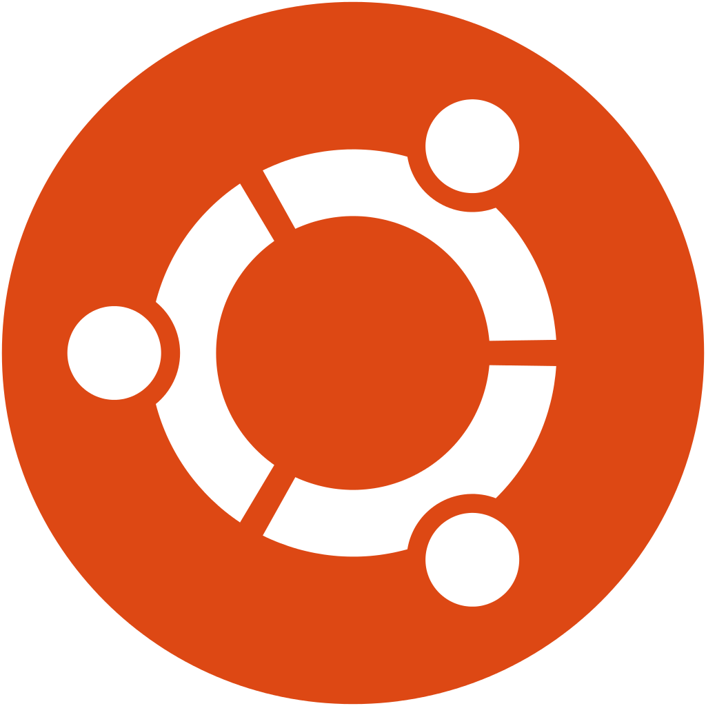

<!---->
<h1>
  👋 
  Hi there ―   
  my name is Julien,   
  passionate developer.
</h1>

<!--## 🛠 Technologies & tools-->
<!--

-->

    
    
    
    
    
    
    
    
    
    
    
    
    
    
    
    
    
    
    
    
    
    
    <!---->

 

### Some words about me

    🎯  I'm currently focused on learning Rust and Solidity.
     
    ☕️‍ I ~~am~~ was front-end developer focused on ~~Javascript~~ TypeScript stack (React, NodeJS). Last <a href="http://chefclub.tv">@Chefclub</a>.
     
    👨‍💻  Between freelance missions, I love working on different side-projects, to learn, for fun, to build things!
     
    🌱  To improve myself, I am also learning English 🇬🇧, Spanish 🇪🇸 and algorithms 📐.
     
    🍺  Beside programming, I am interested in finance, especially in crypto and enjoy to play sports like Mountain Bike or Calisthenics.
     
    ✨ Fun fact, I'm a huge fan of Linux (aka `r/unixporn`), but I've just switched to M1, and it's cool, too 😘.
    <!--
    💬 Ask me about react, redux, nodejs, web scrapping, typescript
     
    ☕️  I'm currently working as Freelancer Frontend developer at <a href="http://chefclub.tv">@Chefclub</a> via <a href="https://www.malt.fr">@Malt</a>.
     
    🎯  I'm focused on <del>Javascript</del> TypeScript stack (React, NodeJS) and I'm a JamStack enthusiast ⚡️.
     
    🌱  To improve myself, I am learning the Rust programming language and consolidating my back-end skills. The eco-system between Typescript and Rust, especially via Deno and WebAssembly look like amazing!
    -->

<h3>
  📫  You can also check out my <b>latest works</b> or <b>contact me</b> on
    
  <a href="https://www.malt.fr/profile/juliencaron">Malt</a>,
  <a href="https://www.linkedin.com/in/caronjulien">Linkedin</a> or on my <a href="https://juliencaron.eu">Portfolio ― juliencaron.eu</a> 
</h3>

### ― See ya! 👋

 

<!-- ## &#x1f4c8; GitHub Stats

-->
